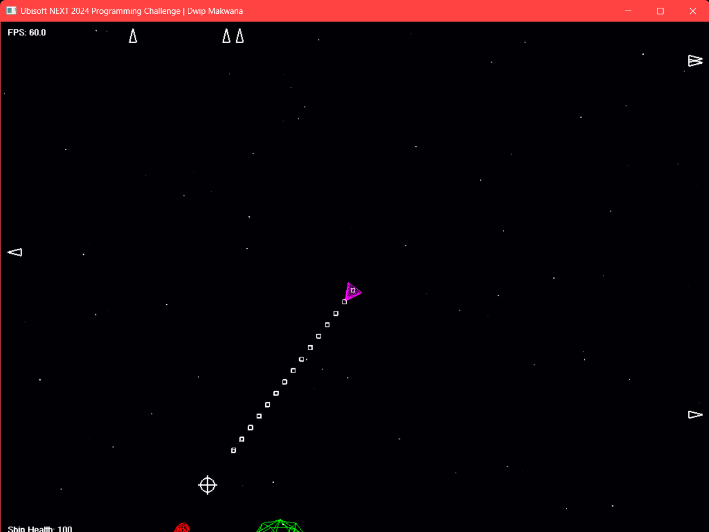
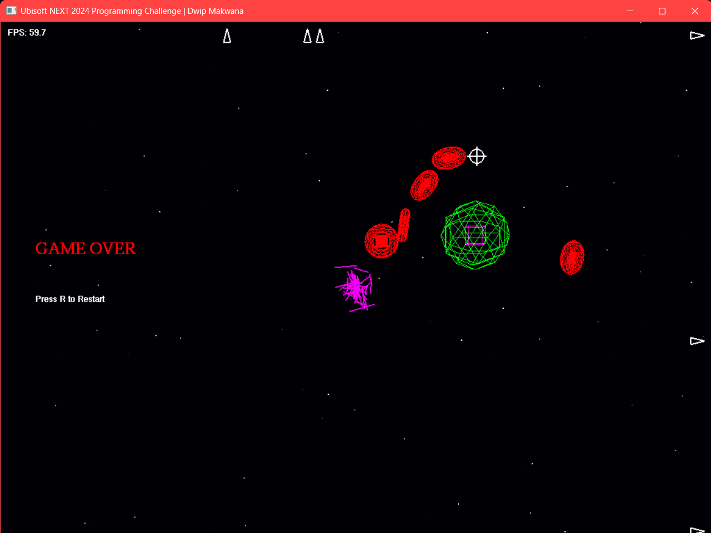

# SpaceShoot OpenGL|C++
A side stage project made in C++ OpenGL. This project was developed solely for practising advanced C++ concepts especially graphics programming for the entry Ubisoft NEXT 2024 competition.

## Screenshots

## License
[MIT](https://choosealicense.com/licenses/mit/)
